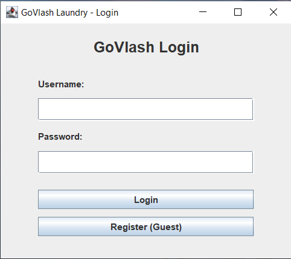
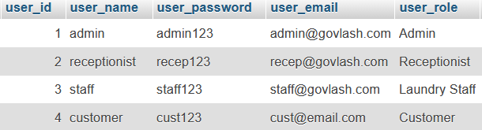
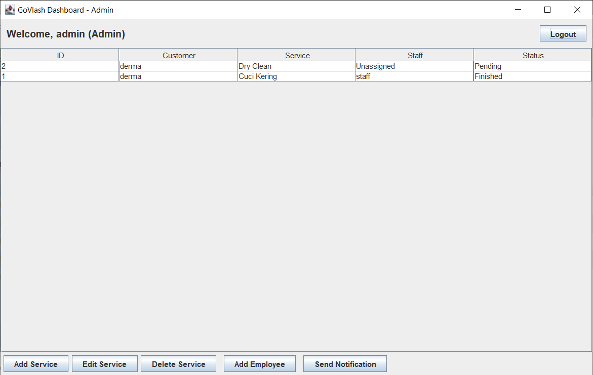
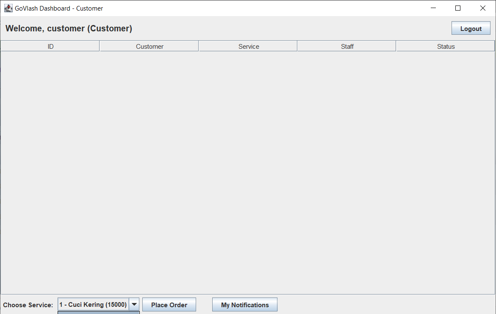

# GoVlash Laundry Management System 

**GoVlash Laundry** adalah aplikasi desktop berbasis Java yang dirancang untuk memodernisasi operasional bisnis laundry. Aplikasi ini dibangun menggunakan arsitektur **MVC (Model-View-Controller)** dan **Java Swing/AWT** (Native GUI) untuk antarmuka penggunanya, dengan **MySQL** sebagai basis data.

Proyek ini dibuat untuk memenuhi tugas mata kuliah *Object Oriented Analysis & Design*, dengan fokus pada pengalaman pengguna (UX) dan validasi data yang ketat tanpa menggunakan library eksternal (No Regex, No FXML).

##  Antarmuka Aplikasi (Screenshots)

Berikut adalah tampilan antarmuka aplikasi GoVlash Laundry:

### 1. Halaman Login
Gerbang masuk untuk semua pengguna (Customer, Admin, Resepsionis, dan Staf).




### 2. Dashboard Utama
Pusat kontrol yang dinamis menyesuaikan dengan Role pengguna (Contoh: Dashboard Admin).




---

##  Fitur Utama

Aplikasi ini menggunakan sistem kontrol akses berbasis peran (*Role-Based Access Control*):

###  Customer (Pelanggan)
* **Registrasi Tamu:** Pengguna baru dapat mendaftar sendiri.
* **Buat Pesanan:** Memilih layanan laundry dan membuat transaksi baru.
* **Riwayat Transaksi:** Melihat status pesanan terkini dan masa lalu.
* **Notifikasi:** Menerima pesan saat cucian telah selesai ("Finished").

###  Admin (Administrator)
* **Manajemen Layanan (CRUD):** Menambah, mengedit, dan menghapus layanan laundry.
* **Manajemen Karyawan:** Mendaftarkan akun untuk Resepsionis dan Staf Laundry.
* **Kirim Notifikasi:** Mengirim notifikasi manual ke pelanggan saat pesanan selesai.
* **Monitoring:** Melihat seluruh transaksi yang berjalan.

###  Receptionist (Resepsionis)
* **Lihat Pesanan Masuk:** Memantau pesanan baru (Status: Pending).
* **Assign Task:** Menugaskan pesanan kepada Staf Laundry tertentu (Status berubah ke: In Progress).

###  Laundry Staff (Staf Cuci)
* **Lihat Tugas:** Hanya melihat pesanan yang ditugaskan kepadanya.
* **Selesaikan Tugas:** Menandai pesanan sebagai 'Finished'.

---

##  Teknologi yang Digunakan

* **Bahasa:** Java (JDK 8+)
* **GUI:** Java Swing & AWT (Native Code, tanpa Drag-and-Drop/SceneBuilder)
* **Arsitektur:** Model-View-Controller (MVC) Pattern
* **Database:** MySQL
* **Konektivitas:** JDBC (`mysql-connector-java`)
* **Validasi:** Logika Java manual (sesuai persyaratan tanpa Regex)

---

##  Cara Instalasi dan Menjalankan

### Prasyarat
1.  **Java Development Kit (JDK)** terinstal.
2.  **MySQL Server** (XAMPP/WAMP) sudah berjalan.
3.  **Eclipse IDE** (atau IDE Java lainnya).
4.  Library **MySQL JDBC Driver** ditambahkan ke Build Path.

### Langkah 1: Setup Database 

Jalankan script SQL berikut di phpMyAdmin atau MySQL Workbench untuk membuat database `govlash_laundry`:

```sql
CREATE DATABASE govlash_laundry;
USE govlash_laundry;

-- Tabel Users
CREATE TABLE users (
    user_id INT AUTO_INCREMENT PRIMARY KEY,
    user_name VARCHAR(50) NOT NULL,
    user_password VARCHAR(50) NOT NULL,
    user_email VARCHAR(100) NOT NULL,
    user_role VARCHAR(20) NOT NULL, 
    user_address VARCHAR(255),
    user_phone VARCHAR(20),
    user_gender VARCHAR(10),
    user_dob DATE
);

-- Tabel Services
CREATE TABLE services (
    service_id INT AUTO_INCREMENT PRIMARY KEY,
    service_name VARCHAR(50) NOT NULL,
    service_price INT NOT NULL,
    service_duration INT NOT NULL
);

-- Tabel Transactions
CREATE TABLE transactions (
    transaction_id INT AUTO_INCREMENT PRIMARY KEY,
    user_id INT,
    service_id INT,
    staff_id INT,
    receptionist_id INT,
    transaction_date DATE,
    transaction_status VARCHAR(20),
    FOREIGN KEY (user_id) REFERENCES users(user_id),
    FOREIGN KEY (service_id) REFERENCES services(service_id)
);

-- Tabel Notifications
CREATE TABLE notifications (
    notification_id INT AUTO_INCREMENT PRIMARY KEY,
    user_id INT,
    message VARCHAR(255),
    created_at DATE,
    is_read BOOLEAN DEFAULT FALSE,
    FOREIGN KEY (user_id) REFERENCES users(user_id)
);

-- Data Dummy Awal
INSERT INTO users (user_name, user_password, user_email, user_role) VALUES 
('Admin System', 'admin123', 'admin@govlash.com', 'Admin'),
('Rara Resepsionis', 'recep123', 'recep@govlash.com', 'Receptionist'),
('Budi Staff', 'staff123', 'staff@govlash.com', 'Laundry Staff'),
('Dodi Customer', 'dodi123', 'dodi@email.com', 'Customer');

INSERT INTO services (service_name, service_price, service_duration) VALUES 
('Cuci Komplit', 15000, 1), ('Dry Clean', 30000, 2);
